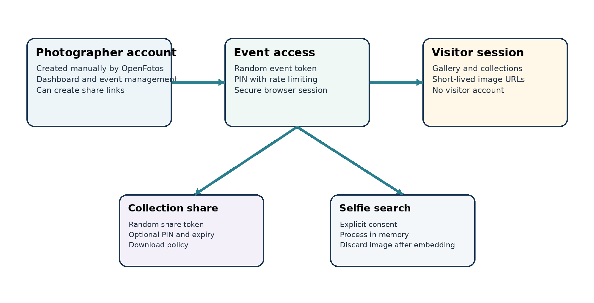
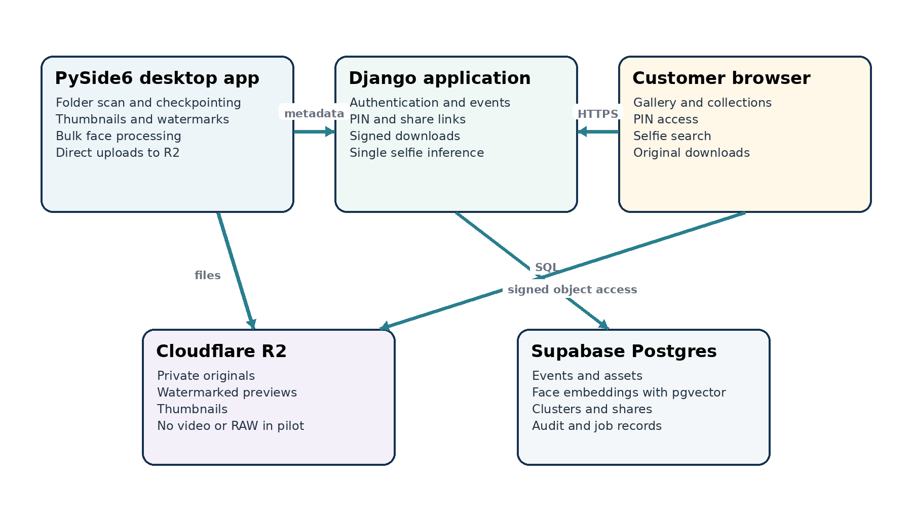
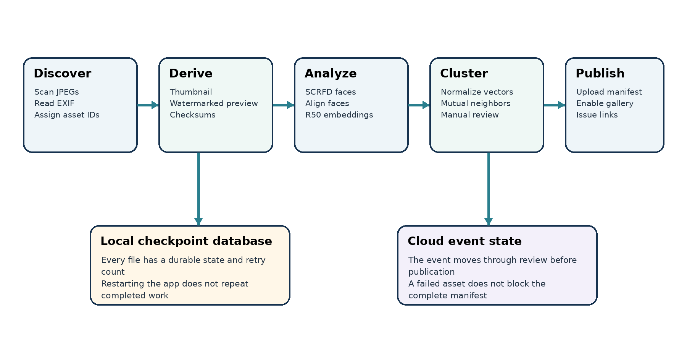

# OpenFotos Product and Technical Plan

*Single-event pilot implementation handbook*

| **Item**         | **Current decision**                               |
|------------------|----------------------------------------------------|
| Pilot            | One photographer and one Indian marriage reception |
| Data             | Less than 20 GB of edited JPEG photographs         |
| Delivery window  | Ten days                                           |
| Operator         | One Python focused AI engineer using Codex         |
| Monthly budget   | Under INR 5,000                                    |
| Primary delivery | Desktop ingestion app plus customer web gallery    |

*Prepared 9 September 2026*

This document records the product definition, technical decisions, implementation sequence, operating procedures and acceptance criteria for the first OpenFotos client event.

# Contents

> 1 Executive summary
>
> 2 Product context and operating assumptions
>
> 3 Pilot scope and exclusions
>
> 4 Users accounts and access
>
> 5 System architecture
>
> 6 Technology stack
>
> 7 Repository and engineering workflow
>
> 8 Desktop ingestion application
>
> 9 Storage and image delivery
>
> 10 Face processing and search
>
> 11 Event lifecycle and orchestration
>
> 12 Database design
>
> 13 API contract
>
> 14 Domains routing and tenancy
>
> 15 Deployment and infrastructure
>
> 16 Security privacy and data handling
>
> 17 Cost estimate
>
> 18 Performance and capacity
>
> 19 Testing and acceptance
>
> 20 Ten day implementation plan
>
> 21 Launch runbook
>
> 22 Risks and mitigations
>
> 23 Post pilot roadmap
>
> 24 Master tracking checklist
>
> 25 Sources and price basis

## Document purpose

OpenFotos needs a working, supervised pilot rather than a general purpose SaaS platform. This plan keeps the customer experience complete while reducing implementation risk. It also establishes interfaces that can scale later without requiring the pilot to contain microservices, a cloud GPU fleet or a full self service onboarding system.

# 1 Executive summary

OpenFotos will help photographers upload an event, present a branded online gallery, group photographs by anonymous faces and let guests find likely photographs by submitting a selfie. The first deployment covers one photographer and one reception containing less than 20 GB of edited JPEG files. Video and camera RAW files are excluded.

The selected architecture uses a PySide6 desktop application for reliable ingestion and bulk local processing. A Django application on Railway provides the photographer dashboard, public galleries, PIN access, share links, signed downloads and single selfie inference. Cloudflare R2 stores private image objects. Supabase PostgreSQL stores application data and pgvector embeddings. The first deployment uses Railway Hobby and Supabase Pro.

The model selection is InsightFace with the buffalo m components: SCRFD 2.5GF detection and the ResNet50 WebFace600K recognition model, executed through ONNX Runtime on CPU. The same recognition model must run in the desktop client and cloud application so their embeddings remain compatible.

## Decisions at a glance

| **Area**    | **Decision**                          | **Reason**                                                                             |
|-------------|---------------------------------------|----------------------------------------------------------------------------------------|
| Repository  | One monorepo                          | A solo developer needs atomic changes across desktop, server and shared vision code.   |
| Desktop     | PySide6 Qt Widgets                    | Cross platform Python source with native packaging and a practical uploader interface. |
| Web         | Django with server rendered pages     | Authentication, ORM, sessions, admin and forms remain in one Python system.            |
| Storage     | Private Cloudflare R2 Standard        | Dynamic capacity, low storage cost and free direct Internet egress.                    |
| Database    | Supabase Pro PostgreSQL with pgvector | Managed database, backups and vector search within the monthly budget.                 |
| Hosting     | Railway Hobby                         | Enough limits for one Django service and two wildcard related custom domains.          |
| Face engine | InsightFace buffalo m                 | Same recognizer as buffalo l with a lighter CPU detector.                              |
| Accounts    | Manual photographer account only      | No public registration, visitor accounts, billing or team invitations are needed.      |

## Definition of success

- Every accepted JPEG is accounted for by a manifest and is either published or shown as a recoverable failure.

- The uploader can resume after a forced application exit without restarting completed work.

- Visitors cannot retrieve gallery metadata, previews or originals without valid event authorization.

- The photographer can review, hide, merge and feature generated face collections before publication.

- A visitor selfie returns useful candidate photographs while the submitted selfie is not retained.

- The complete event can be uploaded, processed, reviewed and published through a rehearsed operating procedure.

# 2 Product context and operating assumptions

## Problem

Reception photographers produce thousands of photographs. Delivery through folders or generic drives makes browsing difficult, and guests often cannot locate the photographs containing them. OpenFotos adds event specific organization and discovery without requiring the photographer to name every attendee.

## Product idea

The photographer uploads edited photographs through a desktop application. OpenFotos creates a branded gallery and anonymous face collections. A couple can share the complete gallery, a selected collection or a selfie search link. A guest who submits a selfie sees probable matches and can download permitted original resolution JPEGs.

## Known pilot constraints

| **Constraint** | **Value**                          | **Architectural consequence**                                        |
|----------------|------------------------------------|----------------------------------------------------------------------|
| Client volume  | One photographer and one reception | Manual provisioning and supervised operations are acceptable.        |
| Data size      | Less than 20 GB                    | R2 storage cost is negligible and local processing is practical.     |
| Media type     | Photographs only                   | Video transcoding and streaming are excluded.                        |
| Input format   | Edited JPEG only                   | RAW decoding, color pipelines and archive expectations are excluded. |
| Compute        | Local CPU only                     | Bulk inference runs locally and is benchmarked before the event.     |
| Developer      | One Python AI engineer             | Python is used across desktop, vision and web components.            |
| Timeline       | Ten days                           | No microservices, public signup, payments or automated scaling.      |
| Budget         | Below INR 5,000 monthly            | Use Railway Hobby, Supabase Pro and R2 Standard.                     |

## Product terminology

| **Term**        | **Meaning in the pilot**                                                                   |
|-----------------|--------------------------------------------------------------------------------------------|
| Original        | The exact edited JPEG uploaded by the photographer, not the camera RAW file.               |
| Preview         | A reduced size JPEG with the photographer watermark burned into the pixels.                |
| Thumbnail       | A small derivative used by the gallery grid.                                               |
| Face collection | An anonymous cluster of visually similar detected faces within one event.                  |
| Selfie search   | A similarity search that returns candidate event photographs, not a statement of identity. |
| Client          | The photographer using OpenFotos for the pilot.                                            |
| Customer        | The couple or event organizer receiving the gallery.                                       |
| Visitor         | A friend, family member or guest opening a shared gallery.                                 |

# 3 Pilot scope and exclusions

## Committed pilot capabilities

- Desktop upload and ingestion of one event.

- Private object storage for original JPEGs, previews and thumbnails.

- Photographer dashboard with event status and gallery controls.

- PIN protected customer access.

- Anonymous face collections ordered by the number of distinct photographs.

- Selfie based photograph search.

- Watermarked previews.

- Individual original resolution JPEG downloads when enabled.

- Full event and collection share links.

- Manual correction controls for important face clusters.

## Explicit exclusions

- Camera RAW files, TIFF archives and video.

- Automatic face names or identity claims.

- A mobile application.

- Public photographer registration, email verification, OAuth and automated password recovery.

- Payments, subscriptions, invoices and usage based customer billing.

- Dynamic watermarking on every request.

- Cloud batch GPU processing.

- Kubernetes, microservices, Redis and a distributed task queue.

- On demand generation of a single 20 GB ZIP archive.

- Team roles beyond OpenFotos administrator and photographer.

- A guarantee that OpenFotos is the sole archival copy.

## Pilot service statement

The pilot accepts edited JPEG photographs only. Original resolution download refers to the original uploaded JPEG. Face collections and selfie results are probabilistic and may require photographer review. The photographer must retain a separate local copy of every photograph until the pilot is complete and verified.

## Deferred but anticipated capabilities

| **Capability**          | **When to consider it**                                                                      |
|-------------------------|----------------------------------------------------------------------------------------------|
| RAW archive add on      | After storage retention, retrieval and deletion policies are contractually defined.          |
| Automated cloud workers | After local processing becomes an operational bottleneck across several simultaneous events. |
| Self service onboarding | After the photographer account and event model are stable across multiple clients.           |
| Custom customer domains | After wildcard OpenFotos subdomains have proven the tenancy model.                           |
| Video delivery          | Only after a separate transcoding, streaming and cost model is designed.                     |

# 4 Users accounts and access

The pilot needs authentication but does not need public account creation. OpenFotos manually creates one photographer account. Customers and visitors use event or share links with PIN based access and do not create accounts.

| **Actor**               | **Access**                        | **Account**          | **Allowed actions**                                               |
|-------------------------|-----------------------------------|----------------------|-------------------------------------------------------------------|
| OpenFotos administrator | Django administrator login        | Yes                  | Create photographer, event and support records; inspect failures. |
| Photographer            | Username and password             | Yes manually created | Upload, review, publish, create shares and control downloads.     |
| Couple or organizer     | Event URL and PIN                 | No                   | Browse permitted gallery and download according to event policy.  |
| Friend or family        | Share URL and optional PIN        | No                   | Browse the complete event or restricted collection.               |
| Selfie visitor          | Authorized event or share session | No                   | Submit one selfie with consent and see probable matches.          |

## Authentication rules

- Django sessions protect the browser dashboard.

- The desktop app uses a short lived API access token and refresh token after photographer login.

- Store desktop refresh tokens in the operating system credential store when practical.

- Hash passwords and event PINs with Argon2.

- Rate limit photographer login, event PIN and selfie endpoints.

- Use secure, HTTP only, SameSite cookies for web sessions.

- A visitor who knows the gallery PIN cannot create share links or change event settings.

# 5 System architecture

## Component boundaries

| **Component**       | **Runs where**                   | **Owns**                                                                                      |
|---------------------|----------------------------------|-----------------------------------------------------------------------------------------------|
| Desktop application | Photographer Windows computer    | Local files, ingestion checkpoint, bulk derivatives, bulk face processing and direct uploads. |
| Django application  | Railway Singapore                | Users, events, policies, sessions, shares, signed URLs and selfie requests.                   |
| PostgreSQL          | Supabase managed region          | Relational metadata, vector embeddings, cluster membership, jobs and audit records.           |
| Object storage      | Cloudflare R2 APAC hinted bucket | Original JPEGs, previews, thumbnails, manifests and temporary export archives.                |
| Customer browser    | Visitor device                   | Gallery presentation, consent capture, download requests and direct R2 transfers.             |

## Trust boundaries

- The desktop application is authenticated but still treated as an external client. The API validates every event ID, object key, model ID and payload size.

- The browser never receives an R2 parent token, Supabase service key or Django secret.

- R2 objects remain private. Django grants short lived access only after authorization.

- Supabase is not called directly from the customer browser in the pilot. Django enforces tenancy and access policy.

- A public repository contains no client media, embeddings, credentials or production environment values.

## Why this is a monolith

Django provides one deployable control plane while the desktop application is a separate client. Internal Django modules may have clear boundaries, but they do not need separate services. This keeps transactions, authentication, deployment and debugging simple. A future worker can call the same vision package and job interfaces without changing public APIs.

# 6 Technology stack

| **Layer**                | **Selected technology**                     | **Implementation notes**                                                                     |
|--------------------------|---------------------------------------------|----------------------------------------------------------------------------------------------|
| Desktop user interface   | PySide6 with Qt Widgets                     | Support one operating system first; build other packages on their native CI runners later.   |
| Desktop packaging        | pyside6 deploy with Nuitka                  | Produce an installer or standalone directory and sign binaries when moving beyond the pilot. |
| Web framework            | Django                                      | Use Django admin, ORM, migrations, sessions and server rendered templates.                   |
| Interactive web behavior | HTMX and small Alpine.js modules            | Keep a separate JavaScript application out of the pilot.                                     |
| Styling                  | Tailwind CSS                                | Compile static CSS during the build; do not use a runtime CDN in production.                 |
| API                      | Django REST Framework or focused JSON views | Version endpoints under api v1 and publish explicit request schemas.                         |
| Database                 | PostgreSQL                                  | Use UUID primary identifiers externally and indexed foreign keys internally.                 |
| Vector search            | pgvector                                    | Filter every query by event before similarity ranking.                                       |
| Object storage           | Cloudflare R2 Standard                      | Use the S3 API with short lived credentials and presigned URLs.                              |
| Image work               | Pillow or pyvips                            | Correct orientation and create fixed derivatives before upload.                              |
| Face engine              | InsightFace buffalo m                       | SCRFD 2.5GF detector and ResNet50 recognizer through ONNX Runtime CPU.                       |
| Hosting                  | Railway Hobby                               | One application replica and explicit resource limits.                                        |
| Database hosting         | Supabase Pro                                | Managed backups and enough capacity for the pilot.                                           |
| Testing                  | pytest and Django test client               | Unit, integration, security and end to end rehearsal tests.                                  |
| Dependency management    | uv                                          | Lock exact versions and generate reproducible desktop and server environments.               |

## Technology alternatives

| **Alternative**            | **Decision**                      | **Reason**                                                                                                           |
|----------------------------|-----------------------------------|----------------------------------------------------------------------------------------------------------------------|
| FastAPI plus Next.js       | Do not use for the pilot          | It adds a second application framework and substantial TypeScript work for one developer.                            |
| Cloudflare only            | Revisit later                     | Workers, D1, Vectorize and Containers are inexpensive but add provider specific architecture and runtime boundaries. |
| Railway PostgreSQL         | Budget fallback                   | Cheaper and colocated, but the database template is operationally managed by OpenFotos.                              |
| DeepFace                   | Benchmark tool only               | Useful abstraction for comparisons but unnecessary in the production processing path.                                |
| face recognition with dlib | Fallback baseline                 | Simple but older and less suitable as the main low light reception model.                                            |
| InsightFace buffalo l      | Quality fallback for group photos | Heavier detector can be used selectively if buffalo m misses distant faces.                                          |

# 7 Repository and engineering workflow

## Repository layout

> openfotos/
>
> apps/
>
> desktop/ PySide6 screens, controllers and local database
>
> server/ Django project and feature applications
>
> packages/
>
> vision/ detection, alignment, embedding and clustering
>
> contracts/ API schemas, enums and model contracts
>
> storage/ object keys, checksums and R2 adapters
>
> infra/
>
> docker/ server image and local development files
>
> railway/ deploy commands and environment examples
>
> tests/
>
> unit/
>
> integration/
>
> fixtures/ synthetic or consented test images only
>
> scripts/
>
> docs/
>
> pyproject.toml
>
> uv.lock

## Repository policy

- Use one monorepo so changes to the API contract and desktop client land together.

- Keep main protected and require tests before merge, even as a solo developer.

- Open source the repository only after secret scanning and removal of all client data.

- Keep model binaries out of Git history. Download verified model artifacts by version and checksum or attach them to a controlled release.

- Never commit dotenv files, R2 tokens, Supabase credentials, production hostnames containing secrets, real selfies or face embeddings.

- Choose the application code licence deliberately. AGPL version 3 is suitable if hosted modifications should remain open; Apache version 2 is suitable if adoption and permissive reuse matter more. Model weights keep their own terms.

## Using Codex safely

- Create one issue and acceptance test set per capability instead of asking for the entire product in one generation.

- Review migrations, authentication changes, object permissions and deletion code manually before running them.

- Require tests around tenant filters and authorization because a missing event filter can expose another gallery later.

- Use synthetic images or a specifically consented test set in development prompts and fixtures.

- Commit after each verified vertical slice so regressions can be isolated without destructive repository operations.

## Continuous integration

| **Trigger**        | **Checks**                                                                                   |
|--------------------|----------------------------------------------------------------------------------------------|
| Every pull request | Formatting, static checks, unit tests, Django checks, migration consistency and secret scan. |
| Merge to main      | Build Django container, run integration tests and deploy staging.                            |
| Version tag        | Build the Windows desktop package and publish checksums.                                     |
| Production release | Run migrations once, deploy one web replica and execute smoke tests.                         |

# 8 Desktop ingestion application

## First release screens

1.  Login screen with server URL, username and password.

2.  Event selector showing status and remaining storage allowance.

3.  Folder selector with discovered file count and total bytes.

4.  Validation screen listing rejected files before upload.

5.  Processing screen with separate derivative, face and upload progress.

6.  Review summary with failures, retry controls and finalization button.

## Local state

A local SQLite database is mandatory. A text log alone cannot reliably resume thousands of files. The database belongs to the selected event and records enough information to detect renamed, modified and completed assets.

| **Field**                    | **Purpose**                                            |
|------------------------------|--------------------------------------------------------|
| local path                   | Find the source file on restart.                       |
| size and modification time   | Fast change detection before recalculating a checksum. |
| SHA 256 checksum             | Stable identity and end to end integrity check.        |
| asset UUID                   | Maps a local file to database and R2 object keys.      |
| derivative state             | Tracks thumbnail and preview generation.               |
| face state                   | Tracks detection, embeddings and uploaded metadata.    |
| upload state                 | Tracks original, preview and thumbnail independently.  |
| attempt count and last error | Controls backoff and makes failures diagnosable.       |

## Uploader requirements

- Accept only files whose extension, MIME type and decoded signature identify a JPEG.

- Reject video, RAW, TIFF, HEIC and oversized files with a visible reason.

- Calculate the event total before starting and enforce a server supplied pilot limit such as 25 GB.

- Request temporary R2 credentials scoped to the event upload prefix. Never ship a parent R2 key.

- Use four concurrent transfers initially, with configurable retry and exponential backoff.

- Upload each object using its UUID key rather than its original filename.

- Refresh credentials before expiry and continue without repeating completed objects.

- Post the manifest only after every accepted asset reaches a terminal state.

- Allow the photographer to retry failed assets and export a diagnostic log.

## Packaging decision

Support the photographer operating system first. For Windows, produce a signed installer when possible, but a standalone folder is acceptable for the supervised pilot. Build macOS and Linux packages later on native CI runners. Cross platform source does not mean one binary can be copied to every operating system.

# 9 Storage and image delivery

## R2 capacity and billing behavior

R2 storage is dynamic. OpenFotos does not pre purchase 20 GB or 100 GB and does not configure a bucket capacity. R2 bills actual GB months, averaged from daily storage usage. At the current Standard rate, 25 GB held for a full month uses the 10 GB free allowance and costs about USD 0.225 for storage before operation charges.

## Object key layout

> events/\<event-uuid\>/originals/\<asset-uuid\>.jpg
>
> events/\<event-uuid\>/previews/\<asset-uuid\>.jpg
>
> events/\<event-uuid\>/thumbnails/\<asset-uuid\>.jpg
>
> events/\<event-uuid\>/manifests/final.json
>
> exports/\<event-uuid\>/\<export-uuid\>.zip
>
> backups/database/\<timestamp\>.dump

## Derivative policy

| **Object**        | **Purpose**                   | **Recommended treatment**                                                                           |
|-------------------|-------------------------------|-----------------------------------------------------------------------------------------------------|
| Original          | Authorized download           | Exact uploaded JPEG; private; content disposition attachment.                                       |
| Preview           | Lightbox and larger browsing  | About 2048 pixels long edge; quality tuned after visual review; watermark burned in.                |
| Thumbnail         | Gallery grid                  | About 400 to 600 pixels long edge; optimized for fast display.                                      |
| Recognition input | Local detection and embedding | Use the local original or a downscaled working image; do not store a separate copy unless required. |

## Delivery rules

- Keep every bucket private.

- Django verifies the event or share session before generating a presigned GET URL.

- Use short expiries, normally five to fifteen minutes.

- Serve image bytes directly from R2 so Railway does not pay image egress or handle large responses.

- Strip GPS and unnecessary EXIF metadata from derivatives while leaving the original unchanged.

- Burn the watermark into the preview once during ingestion.

- Do not dynamically build a complete event ZIP on the Django server. Prepare exports as offline jobs if required.

- The photographer keeps a local copy. R2 is the delivery store for the pilot, not the only archive.

## Upload credentials

Django requests short lived R2 credentials from Cloudflare using a parent token held only in the server environment. The credentials are limited to one bucket and the event prefix. The desktop client treats them as bearer secrets, renews them when required and removes them when the event session ends.

# 10 Face processing and search

## Selected model

The pilot uses InsightFace buffalo m components. SCRFD 2.5GF detects faces and provides five landmarks. The ResNet50 WebFace600K model produces recognition embeddings. ONNX Runtime executes both models on CPU. Buffalo m and buffalo l use the same recognizer; buffalo m reduces detection cost relative to the 10GF detector used by buffalo l.

## Processing pipeline

7.  Read the JPEG and apply EXIF orientation.

8.  Create a detection image with a configured maximum dimension.

9.  Run SCRFD and map boxes and landmarks back to original coordinates.

10. Reject faces that fail configurable size, confidence, blur or pose checks.

11. Align each accepted face from its five landmarks.

12. Generate and L2 normalize the ResNet50 embedding.

13. Store asset ID, event ID, box, confidence, quality values, model ID and embedding.

14. Build conservative neighbor relationships inside the event only.

15. Create anonymous clusters and calculate distinct photograph counts.

16. Require photographer review before the event is published.

## Normal and group photo modes

| **Mode**        | **Use**                          | **Method**                                                       |
|-----------------|----------------------------------|------------------------------------------------------------------|
| Normal          | Portraits and medium groups      | Run SCRFD 2.5GF on one resized image.                            |
| Group fallback  | Large stage or crowd photographs | Increase detection resolution or process overlapping tiles.      |
| Manual fallback | Important missed faces           | Allow reprocessing selected photographs with a heavier detector. |

## Clustering policy

The system should prefer duplicate clusters over a cluster containing two people. A false merge can expose unrelated photographs during selfie search. The initial implementation can use mutual nearest neighbors with a conservative cosine threshold and connected components. The threshold must be calibrated on real reception photographs rather than copied from a benchmark.

- Cluster only within one event.

- Count distinct photographs rather than raw face detections when ordering collections.

- Hide clusters containing fewer than a configurable number of useful photographs.

- Provide merge, hide, feature and rebuild controls.

- Do not expose age or gender predictions.

- Do not assign names automatically.

## Selfie search

17. Confirm the visitor has an authorized event or share session.

18. Show a plain language consent notice and require affirmative action.

19. Accept one image within a strict byte and pixel limit.

20. Decode it in memory, reject invalid content and detect the most prominent face.

21. Generate an embedding with the same recognition model used by the desktop app.

22. Discard the submitted image after the request completes.

23. Query pgvector within the current event only.

24. Deduplicate results by photograph and return candidates above the calibrated threshold.

25. Rate limit repeated searches and log only operational metadata.

## Model reproducibility

- Pin ONNX Runtime, InsightFace and model artifact versions.

- Record SHA 256 hashes for every model file.

- Save the detector, recognizer, embedding and threshold version with each event.

- Refuse to search an event when the server recognizer is incompatible with its embedding version.

- Keep a model adapter so another recognizer can be introduced without rewriting storage and gallery code.

## Open source and model licensing

OpenFotos may publish its application source and may ask photographers to pay only their infrastructure costs. Those choices do not replace the separate terms attached to pretrained model weights. Contact the InsightFace licensing address, record the response and keep model weights outside the application code licence. The architecture remains usable with another ONNX recognizer if terms require a replacement.

# 11 Event lifecycle and orchestration

| **State**  | **Entry condition**                       | **Allowed next states**                              |
|------------|-------------------------------------------|------------------------------------------------------|
| Draft      | Event created and photographer assigned   | Uploading or cancelled                               |
| Uploading  | Desktop session issued                    | Processing or failed                                 |
| Processing | Asset manifest accepted                   | Review or failed                                     |
| Review     | Derivatives and initial clusters complete | Published or processing                              |
| Published  | Photographer approves gallery             | Archived or review                                   |
| Archived   | Gallery is no longer active               | Published or deleted according to policy             |
| Failed     | A blocking job failed                     | Uploading, processing or cancelled after remediation |

## Asset state

> DISCOVERED -\> VALIDATED -\> DERIVED -\> UPLOADED -\> ANALYZED -\> COMMITTED
>
> -\> FAILED \<---------------------/

The state machine must be idempotent. Repeating a completed API request or processing command should return the current result instead of creating duplicate assets, faces or uploads.

## Operational orchestration

- The desktop client owns bulk work during the pilot and reports progress to Django.

- Django records jobs and state but does not queue thousands of inference tasks.

- A failed asset can be retried independently.

- Finalization verifies the manifest, required object variants and metadata counts.

- Publishing is a separate deliberate action after face cluster review.

- Later, a cloud worker can consume the same job contract without changing galleries or database tables.

## Idempotency keys

Every mutating desktop request should include an idempotency key derived from event, operation and asset UUID. The server stores completed keys for an appropriate period. This prevents retries after poor connectivity from generating duplicate face rows or finalization records.

# 12 Database design

| **Table**          | **Important fields**                                                    | **Purpose**                                          |
|--------------------|-------------------------------------------------------------------------|------------------------------------------------------|
| photographer       | id, slug, display name, status                                          | Tenant and branded subdomain owner.                  |
| user               | Django user fields                                                      | OpenFotos administrator and photographer login.      |
| photographer user  | photographer id, user id, role                                          | Future ready membership boundary.                    |
| event              | id, photographer id, token, PIN hash, state, limits, expiry             | Reception and its access policy.                     |
| asset              | id, event id, filename, bytes, checksum, dimensions, object keys, state | One uploaded photograph and its derivatives.         |
| face               | id, event id, asset id, box, quality, model id, embedding               | One accepted face detection.                         |
| face cluster       | id, event id, status, photo count, rank, featured                       | Anonymous face collection.                           |
| cluster member     | cluster id, face id, similarity                                         | Cluster membership and evidence.                     |
| share link         | id, event id, token hash, cluster id, permissions, expiry               | Complete event or restricted sharing.                |
| processing job     | id, event id, type, state, counts, error, timestamps                    | Observable processing lifecycle.                     |
| idempotency record | key, user id, response hash, expiry                                     | Safe client retries.                                 |
| audit event        | actor, event id, action, IP hash, timestamp, result                     | Security and operational trace.                      |
| consent record     | event id, notice version, timestamp, request reference                  | Evidence that selfie processing notice was accepted. |

## Database rules

- Every event owned row includes event ID or has an unambiguous foreign key path to it.

- Every query from a customer route filters by both photographer and event.

- Use UUIDs for external identifiers and unique random tokens for public links.

- Store only object keys in the database, never permanent public image URLs.

- Use database constraints to prevent one event from referencing another event cluster or asset.

- Create vector and relational indexes only after representative query measurements.

- Use migrations for every schema change and back up before production migrations.

## Embedding storage estimate

A 512 dimensional float32 embedding occupies about 2 KB before row and index overhead. Ten thousand faces therefore require about 20 MB of raw vector values. Even after PostgreSQL and HNSW index overhead, Supabase Pro provides ample space for the first event. Actual face count must be measured during the benchmark.

# 13 API contract

Use a versioned JSON API for desktop operations. Browser pages may use Django forms and HTMX, but sensitive actions still enforce the same service layer authorization.

| **Method and route**                     | **Caller** | **Purpose**                                             |
|------------------------------------------|------------|---------------------------------------------------------|
| POST api v1 auth login                   | Desktop    | Authenticate photographer and issue short lived tokens. |
| GET api v1 events                        | Desktop    | List events assigned to the photographer.               |
| POST api v1 events id upload session     | Desktop    | Issue temporary prefix scoped R2 credentials.           |
| POST api v1 events id assets batch       | Desktop    | Reserve asset UUIDs and upload object keys.             |
| POST api v1 events id assets id complete | Desktop    | Confirm object variants, sizes and checksums.           |
| POST api v1 events id faces batch        | Desktop    | Upload validated face metadata and embeddings.          |
| POST api v1 events id clusters batch     | Desktop    | Upload initial cluster membership and metrics.          |
| POST api v1 events id finalize           | Desktop    | Close ingestion and request validation.                 |
| GET api v1 jobs id                       | Desktop    | Read validation and event processing status.            |
| POST event token unlock                  | Browser    | Verify PIN and create an authorized event session.      |
| POST event token selfie search           | Browser    | Process one selfie and return candidate asset IDs.      |
| POST event token assets id download      | Browser    | Authorize and return a short lived original URL.        |

## API requirements

- Use explicit schemas and reject unknown or oversized fields.

- Return stable machine readable error codes and a human readable message.

- Require an idempotency key on batch commits and finalization.

- Never accept an arbitrary bucket name or object key from a client.

- Paginate gallery and asset responses.

- Do not return embeddings, internal object keys or face crops to public visitors.

- Return short lived URLs only after checking download policy and session authorization.

- Log request identifiers so desktop failures can be correlated with server logs.

## Representative error codes

| **Code**                | **Meaning**                                                       |
|-------------------------|-------------------------------------------------------------------|
| event not found         | The authenticated photographer cannot access the requested event. |
| event storage limit     | The declared manifest would exceed the event byte allowance.      |
| asset checksum mismatch | The uploaded object differs from the manifest.                    |
| model version mismatch  | Embedding metadata is incompatible with the event model contract. |
| event not ready         | A visitor attempted to access an unpublished event.               |
| rate limited            | Login, PIN or selfie request exceeded the configured policy.      |

# 14 Domains routing and tenancy

## URL design

> https://abc.openfotos.in/
>
> https://abc.openfotos.in/e/\<random-event-token\>/
>
> https://abc.openfotos.in/s/\<random-share-token\>/
>
> https://abc.openfotos.in/dashboard/

The subdomain identifies the photographer. The random token identifies an event or share. The PIN verifies the visitor. These controls are complementary and can be used together.

## Wildcard setup

26. Register openfotos.in and use Cloudflare authoritative DNS.

27. Add wildcard domain \*.openfotos.in to the Railway Django service.

28. Create the CNAME and TXT records Railway provides.

29. Keep Railway certificate validation records such as the acme challenge record DNS only when instructed.

30. Enable Cloudflare Universal SSL and the Railway recommended encryption mode.

31. Add the apex openfotos.in as the second Railway custom domain if the marketing or redirect page uses the same service.

32. Configure Django allowed hosts for .openfotos.in and generate CSRF trusted origins deliberately.

## Routing behavior

Middleware normalizes the Host header, extracts the first level label and loads the active photographer by unique slug. Reserved names such as www, admin, api, static and media cannot be claimed. The event lookup uses both photographer and public token, which prevents a valid token from being used under another photographer domain.

## Cookie behavior

Prefer host only cookies so an event session for one photographer subdomain is not automatically sent to every photographer subdomain. Administrative sessions and public event sessions should use different cookie names and authorization checks.

# 15 Deployment and infrastructure

## Selected deployment

| **Provider** | **Service**                          | **Plan**                                            |
|--------------|--------------------------------------|-----------------------------------------------------|
| Cloudflare   | Registrar, DNS, Universal SSL and R2 | Free platform features plus usage based R2 Standard |
| Railway      | Django container                     | Hobby with one replica                              |
| Supabase     | PostgreSQL and pgvector              | Pro                                                 |

## Railway application configuration

- Run one Gunicorn worker with several threads initially so the ONNX models are not duplicated across processes.

- Target about 1 GB RAM and monitor actual usage during the 1,000 photo benchmark and selfie tests.

- Use a release command for Django migrations and prevent multiple replicas from running migrations concurrently.

- Serve static application assets through WhiteNoise or a separate static delivery mechanism. Photograph objects remain in R2.

- Choose the closest practical Railway region, currently Singapore, and measure database latency if Supabase is in Mumbai.

- Set a cost alert before launch. A hard cost limit can stop the application, so it must not be set below expected live usage.

## Environment variables

> DJANGO_SECRET_KEY
>
> DJANGO_ALLOWED_HOSTS
>
> DATABASE_URL
>
> R2_ACCOUNT_ID
>
> R2_BUCKET_NAME
>
> R2_PARENT_ACCESS_KEY_ID
>
> R2_PARENT_SECRET_ACCESS_KEY
>
> R2_LOCATION_HINT
>
> PUBLIC_BASE_DOMAIN
>
> MODEL_ID
>
> MODEL_DIRECTORY
>
> SELFIE_MAX_BYTES
>
> SIGNED_URL_TTL_SECONDS
>
> EVENT_SESSION_TTL_SECONDS
>
> SENTRY_DSN optional
>
> EMAIL_FROM_ADDRESS optional

Use Railway and Supabase secret stores. Keep only a redacted example file in the public repository.

## Database location

Supabase offers a Mumbai region. Choosing Mumbai keeps database records and face embeddings in India, while the Railway application may run in Singapore. R2 supports an APAC location hint but does not guarantee India specific residency. If a client contract later requires every photograph to remain in India, select a storage provider with an explicit Mumbai residency guarantee.

## Alternative deployments

| **Option**                         | **Approximate cost**                    | **Assessment**                                                                                          |
|------------------------------------|-----------------------------------------|---------------------------------------------------------------------------------------------------------|
| Railway plus Supabase plus R2      | USD 35 to 43 monthly                    | Recommended for the pilot because database operations and backups are managed.                          |
| Railway app and PostgreSQL plus R2 | USD 20 to 30 monthly                    | Cheaper, but OpenFotos owns database tuning, backup configuration and restore tests.                    |
| Cloudflare only                    | Potentially under USD 15 at pilot scale | Technically possible with Workers, D1, Vectorize and Containers, but adds platform specific complexity. |

# 16 Security privacy and data handling

## Security baseline

- Private R2 bucket with no anonymous listing or object access.

- Short lived prefix scoped desktop credentials and short lived visitor download URLs.

- Argon2 password and PIN hashing with server side rate limiting.

- Secure cookies, CSRF protection, HTTPS and strict allowed host validation.

- Database tenancy filters and constraints on every event owned resource.

- Image decoder limits for bytes, pixels and dimensions to reduce decompression attacks.

- Dependency locking, automated vulnerability checks and secret scanning.

- Audit events for login, PIN failures, publication, share creation, downloads and administrative changes.

- Daily database backup and a tested restore procedure.

- No production secrets or client data in the public repository.

## Selfie privacy

- Explain that the selfie is used to find visually similar faces in one event.

- Require a clear affirmative consent action before upload.

- Process the image in memory and remove temporary files in success and error paths.

- Do not retain the selfie by default.

- Do not use selfies or event photographs to train models without separate consent.

- Provide a contact and deletion request mechanism.

- Apply special care when children may appear in the event.

## Suggested selfie notice

Upload a clear photo of your face to search this event. OpenFotos will analyze the photo only to find likely matches in this event. The submitted selfie will be discarded after the search. Results may contain errors. By continuing, you consent to this processing for the stated purpose.

## Retention policy for the pilot

| **Data**                      | **Recommended pilot retention**                                                                 |
|-------------------------------|-------------------------------------------------------------------------------------------------|
| Originals and derivatives     | Until the photographer selected event expiry, followed by a documented deletion window.         |
| Face embeddings and clusters  | The same period as the event because they power gallery features.                               |
| Submitted selfies             | Do not retain after the request.                                                                |
| Operational and security logs | Retain according to legal and incident response requirements while minimizing personal content. |
| Database backups              | Seven day managed retention on Supabase Pro, with deletion behavior documented.                 |

## Indian data protection considerations

The Digital Personal Data Protection Act requires clear purpose based processing, reasonable security safeguards and mechanisms for rights such as withdrawal and erasure when applicable. The final 2025 Rules use phased commencement and describe minimum safeguards and breach notifications. OpenFotos should build toward those controls now and obtain Indian legal review before serving multiple photographers. This plan is technical guidance, not legal advice.

# 17 Cost estimate

## Expected monthly infrastructure

| **Component**    | **Assumption**                                        | **Expected monthly cost**    |
|------------------|-------------------------------------------------------|------------------------------|
| Cloudflare R2    | 20 GB originals plus up to 5 GB derivatives           | About USD 0.23               |
| R2 operations    | Fewer than one million writes and ten million reads   | Likely within included usage |
| R2 direct egress | Gallery and download delivery from R2                 | USD 0                        |
| Supabase Pro     | One project with Micro compute and 8 GB disk          | USD 25                       |
| Railway          | One Django replica near 1 GB RAM with low average CPU | About USD 10 to 18           |
| Total            | Before taxes and currency conversion                  | About USD 35 to 43           |
| Budget view      | Using a conservative currency and tax buffer          | About INR 4,000 to 4,700     |

## R2 calculation

R2 Standard storage currently costs USD 0.015 per GB month and includes 10 GB month free. If the event occupies 25 GB for the complete month, 15 billable GB multiplied by USD 0.015 equals USD 0.225. Capacity is automatic and nothing is purchased in advance.

## Railway Hobby and Pro

| **Actual Railway usage** | **Hobby bill** | **Pro bill** |
|--------------------------|----------------|--------------|
| USD 3                    | USD 5          | USD 20       |
| USD 12                   | USD 12         | USD 20       |
| USD 23                   | USD 23         | USD 23       |

The plan fee is a minimum usage commitment. Hobby includes the first USD 5 of resource usage and Pro includes the first USD 20. Hobby is appropriate for development and the supervised pilot. Its two custom domains are enough for openfotos.in and \*.openfotos.in. Upgrade when collaborators, priority support or sustained production use justify Pro.

## Cost controls

- Set Railway email alerts around expected usage before the event.

- Review one week of observed Railway usage before finalizing the monthly estimate.

- Avoid a low production hard limit because reaching it shuts down the workload.

- Enable the Supabase spend cap where supported.

- Track bytes stored per event in OpenFotos independently from the provider bill.

- Keep image delivery direct from R2 to avoid Railway egress charges.

# 18 Performance and capacity

## Upload duration for 20 GB

| **Measured upload speed** | **Approximate duration with overhead** |
|---------------------------|----------------------------------------|
| 10 Mbps                   | 5.5 hours                              |
| 20 Mbps                   | 2.8 hours                              |
| 50 Mbps                   | 1.1 hours                              |
| 100 Mbps                  | 35 minutes                             |

Measure the photographer uplink from the computer and network that will perform the real upload. The application should remain useful when this takes several hours and should not depend on an uninterrupted browser tab.

## Required face benchmark

Run 500 to 1,000 representative reception images before full implementation is considered safe. Include portraits, stage photos, crowd photos, low light, profiles, makeup, glasses and partial occlusion.

| **Metric**                 | **What to record**                                                         |
|----------------------------|----------------------------------------------------------------------------|
| Decode and derivative time | Seconds per photograph and peak memory.                                    |
| Detection time             | Normal and group fallback modes separately.                                |
| Faces per photograph       | Median, high percentile and maximum.                                       |
| Missed useful faces        | Manual count on a labeled sample.                                          |
| False detections           | Manual count and common causes.                                            |
| Cluster quality            | Wrong identity merges, duplicate identities and useful top clusters.       |
| Selfie retrieval           | Top result precision for several consenting participants.                  |
| Projected event runtime    | Measured total multiplied by expected photograph count plus safety margin. |

## Performance principles

- Pipeline disk work, inference and uploads, but limit concurrency so the photographer computer remains responsive.

- Generate previews once and reuse them.

- Paginate gallery metadata and lazy load thumbnails.

- Load the server face model once per application process.

- Return candidate asset identifiers before issuing image URLs.

- Measure before adding approximate indexes, extra workers or cloud GPUs.

# 19 Testing and acceptance

## Automated test groups

| **Group**      | **Required coverage**                                                                        |
|----------------|----------------------------------------------------------------------------------------------|
| Storage        | Object key generation, credential scope, checksum validation and signed URL authorization.   |
| Authentication | Photographer login, token refresh, PIN attempts, cookie security and authorization failures. |
| Tenancy        | Cross photographer and cross event access is denied for every resource type.                 |
| Uploader       | Restart, duplicate scan, changed file, expired credentials, partial failure and retry.       |
| Images         | Orientation, corrupt JPEG, extreme dimensions, EXIF removal and watermark output.            |
| Faces          | No face, one face, many faces, invalid embedding and model mismatch.                         |
| Gallery        | Pagination, cluster visibility, download policy and expired share.                           |
| Privacy        | Selfie removal on success, validation failure, timeout and unexpected exception.             |
| Deployment     | Migration, health check, static assets and production host validation.                       |

## Pilot acceptance criteria

\[ \] The desktop app discovers the complete client folder and reports the exact total bytes before upload.

\[ \] A forced exit during upload resumes without repeating already completed assets.

\[ \] Every published photograph has an original, preview, thumbnail and database record.

\[ \] No private object can be retrieved without an authorized short lived URL.

\[ \] The photographer can correct the highest ranked face collections before publication.

\[ \] At least five consenting test participants review selfie results on representative event photographs.

\[ \] A submitted selfie is absent from persistent object storage, database fields and logs.

\[ \] Original downloads preserve the uploaded JPEG bytes and filename metadata presented to the user.

\[ \] A database backup can be restored into a separate test project or database.

\[ \] The full rehearsal completes from an empty database and bucket prefix using the documented runbook.

## Manual security tests

- Change event IDs and asset IDs in requests and confirm denial.

- Reuse expired R2 and share credentials and confirm denial.

- Attempt PIN brute force and verify throttling.

- Upload files with misleading extensions and MIME types.

- Submit decompression bomb dimensions and oversized selfie payloads.

- Confirm errors never disclose database URLs, R2 keys or filesystem paths.

- Open a signed image URL after expiry and confirm it no longer works.

# 20 Ten day implementation plan

| **Day** | **Primary deliverable**                               | **Completion condition**                                                      |
|---------|-------------------------------------------------------|-------------------------------------------------------------------------------|
| 1       | Repository, Django skeleton, database and R2          | Health check deploys; event can be created in Django admin.                   |
| 2       | Accounts, tenancy, PIN sessions and domain groundwork | Photographer dashboard and protected sample event work.                       |
| 3       | Desktop shell, local SQLite and directory validation  | Folder scan survives restart and rejects unsupported files.                   |
| 4       | Temporary credentials and resumable direct upload     | Interrupted test upload resumes and the manifest reconciles.                  |
| 5       | Derivatives and gallery                               | Private thumbnails and watermarked previews display after authorization.      |
| 6       | InsightFace benchmark and embedding contract          | Measured report for 500 to 1,000 real images; model choice confirmed.         |
| 7       | Face ingestion, clustering and review tools           | Collections can be hidden, merged and featured.                               |
| 8       | Selfie search and original downloads                  | Consent, in memory processing, scoped vector search and signed download work. |
| 9       | Security, backups and full rehearsal                  | End to end run completes from empty state and restore is tested.              |
| 10      | Defect buffer and client walkthrough                  | Launch checklist is signed off and rollback steps are ready.                  |

## Daily working rule

Each day ends with a demonstrable vertical slice, automated tests for its critical rules and a tagged known good commit. If the face benchmark on day 6 fails the schedule or quality requirement, use day 7 to simplify detection and prioritize reviewed bride, groom and requested participant searches rather than adding unrelated features.

## Priority order if time slips

33. Private reliable upload and complete manifest.

34. PIN protected gallery with watermarked previews.

35. Original resolution download authorization.

36. Selfie search for clear faces.

37. Anonymous collections with manual correction.

38. Polish, extra settings and broader operating system packaging.

# 21 Launch runbook

## Before receiving client files

\[ \] Confirm the photographer operating system and actual upload bandwidth.

\[ \] Create the photographer account, slug and event manually.

\[ \] Confirm the 25 GB event allowance and JPEG only policy.

\[ \] Confirm watermark file, placement and preview quality.

\[ \] Confirm whether downloads are enabled for the complete event or selected shares.

\[ \] Create production R2, Supabase and Railway resources.

\[ \] Verify wildcard TLS and both event and share URLs.

\[ \] Enable database backups and test one restore.

\[ \] Store recovery credentials separately from the application environment.

## During ingestion

\[ \] Record discovered file count and bytes before upload.

\[ \] Keep the photographer original directory unchanged.

\[ \] Monitor failed assets and credential refresh events.

\[ \] Export the final manifest and compare its counts with the source directory.

\[ \] Review the processing duration projection after the first 500 photographs.

## Before publication

\[ \] Review the complete gallery for missing or incorrectly oriented images.

\[ \] Review top face clusters and correct false merges.

\[ \] Test the bride and groom or equivalent prominent participant searches.

\[ \] Test visitor access in a private browser session.

\[ \] Test expired PIN sessions and share links.

\[ \] Download several originals and compare their checksums.

\[ \] Confirm selfie files are not retained.

\[ \] Confirm monitoring, support contact and rollback procedures.

## After publication

\[ \] Monitor application errors, PIN failures, search failures and storage growth.

\[ \] Keep the client informed of known face matching limitations.

\[ \] Record support incidents and fixes against the deployed version.

\[ \] Agree the event expiry and deletion date in writing.

\[ \] Export operational metrics without exporting face images or embeddings.

# 22 Risks and mitigations

| **Risk**                                   | **Impact**                               | **Mitigation**                                                                              |
|--------------------------------------------|------------------------------------------|---------------------------------------------------------------------------------------------|
| CPU inference is too slow                  | Gallery publication is delayed           | Benchmark early; use buffalo m; downscale normal photos; run group fallback selectively.    |
| Small group faces are missed               | Incomplete collections                   | Increase resolution or tile only selected group photos; allow reprocessing.                 |
| Two people merge into one cluster          | Unrelated photographs may appear         | Use conservative thresholds, manual review and merge rather than aggressive grouping.       |
| Desktop app exits during upload            | Hours of work may be lost                | Persist per file state in SQLite and make every upload and API commit idempotent.           |
| Credentials leak from public source        | Storage or personal data exposure        | No secrets in Git; server mints short lived prefix scoped credentials; run secret scanning. |
| PIN is shared widely                       | Gallery audience expands                 | Use random event token, rate limiting, expiry and revocable share links.                    |
| Selfie is retained accidentally            | Privacy breach                           | Use memory processing, explicit cleanup paths and tests covering every failure mode.        |
| R2 is assumed to guarantee India residency | Contract or compliance mismatch          | Disclose APAC hint limitations and change storage provider if India residency is required.  |
| Railway cost limit stops service           | Live gallery outage                      | Use alerts first and set any hard limit above tested normal usage.                          |
| Database loss or bad migration             | Events and face mappings are unavailable | Managed backups, pre migration backups and a tested restore drill.                          |
| Model terms remain unresolved              | Distribution or use must change          | Request permission, separate model assets and preserve a replaceable model interface.       |
| Client treats pilot as permanent archive   | Loss expectations exceed design          | Require the photographer to keep local originals and document retention explicitly.         |

## Go or no go review

Do not publish the event until private object access, manifest completeness, cluster review, selfie deletion and original download checks pass. If model accuracy is insufficient, publish the secure gallery and downloads first and label face features as limited pilot functionality while correcting the pipeline. Do not weaken authorization or privacy controls to meet the date.

# 23 Post pilot roadmap

| **Phase**                    | **Trigger**                                     | **Likely work**                                                                               |
|------------------------------|-------------------------------------------------|-----------------------------------------------------------------------------------------------|
| Pilot stabilization          | First event completed                           | Fix failure modes, improve logs, automate restore tests and package the supported desktop OS. |
| Several photographers        | Repeated manual onboarding                      | Self service signup, organization roles, quotas, event templates and support tooling.         |
| Concurrent events            | Local processing becomes a bottleneck           | Queue abstraction, cloud CPU or GPU workers and per event scheduling.                         |
| Higher search scale          | Vector queries or database size become material | Tune pgvector HNSW or evaluate Cloudflare Vectorize with event metadata filters.              |
| Independent desktop releases | Desktop cadence diverges                        | Signed auto updates, compatibility policy and possibly a separate repository.                 |
| Archive product              | Clients request RAW retention                   | Separate archive tier, retrieval pricing, retention policy and checksum audits.               |
| Advanced delivery            | Clients request albums or bulk exports          | Offline export jobs, selection workflows and controlled ZIP segmentation.                     |
| Residency requirements       | Contract demands India only storage             | Move images to a provider with an explicit Mumbai residency guarantee.                        |

## Metrics to collect during the pilot

- Photographs, bytes and faces per event.

- Upload throughput, retry rate and total ingestion time.

- Derivative and inference seconds per photograph.

- Percentage of assets requiring retry or manual intervention.

- Number of initial clusters, merges, hidden clusters and featured clusters.

- Selfie searches, zero result searches and user reported wrong matches.

- Preview reads, original downloads and share link usage.

- Infrastructure cost by provider and approximate cost per event.

- Support time spent before, during and after publication.

## Decisions to revisit after the first event

- Whether PySide6 packaging and updates are acceptable to photographers.

- Whether buffalo m finds enough small group faces on typical hardware.

- Whether clustering should remain local or move to a cloud job.

- Whether Supabase Pro provides enough value compared with Railway PostgreSQL.

- Whether guests need accountless PIN access, mobile OTP or both.

- Whether collection sharing should be controlled by the photographer or couple.

- Whether event storage should expire automatically and at what interval.

# 24 Master tracking checklist

## Product and client agreement

\[ \] JPEG only and no video or RAW confirmed in writing.

\[ \] Original means uploaded edited JPEG.

\[ \] Face matching limitations explained.

\[ \] Download and retention policies agreed.

\[ \] Photographer keeps a separate original copy.

## Cloud accounts

\[ \] Cloudflare domain and R2 billing active.

\[ \] Railway Hobby workspace active.

\[ \] Supabase Pro project active.

\[ \] Cost alerts and spend controls reviewed.

\[ \] Recovery credentials stored safely.

## Desktop

\[ \] Login and event selection.

\[ \] Folder scan and validation.

\[ \] SQLite checkpoint.

\[ \] Derivative generation.

\[ \] InsightFace processing.

\[ \] Temporary R2 credentials.

\[ \] Resume and retry.

\[ \] Final manifest.

\[ \] Supported OS package.

## Web application

\[ \] Photographer dashboard.

\[ \] Event state management.

\[ \] PIN session.

\[ \] Gallery pagination.

\[ \] Face collections.

\[ \] Cluster review controls.

\[ \] Share links.

\[ \] Selfie search.

\[ \] Original downloads.

## Security and privacy

\[ \] Private bucket.

\[ \] Tenant authorization tests.

\[ \] Argon2 hashes.

\[ \] Rate limits.

\[ \] Secure cookies and CSRF.

\[ \] Selfie deletion tests.

\[ \] Audit logging.

\[ \] Backup restore test.

\[ \] Secret scan before public repository release.

## Launch

\[ \] Real bandwidth measured.

\[ \] Model benchmark completed.

\[ \] Full event rehearsal completed.

\[ \] Wildcard domain verified.

\[ \] Client walkthrough completed.

\[ \] Rollback steps documented.

\[ \] Event expiry date recorded.

# 25 Sources and price basis

Prices, feature limits and platform behavior were checked against official documentation available on 9 September 2026. Provider prices may change. The implementation should recheck them before launch and should use provider billing alerts.

**1. Cloudflare R2 pricing** [<u>https://developers.cloudflare.com/r2/pricing/</u>](https://developers.cloudflare.com/r2/pricing/)

**2. Cloudflare R2 upload objects** [<u>https://developers.cloudflare.com/r2/objects/upload-objects/</u>](https://developers.cloudflare.com/r2/objects/upload-objects/)

**3. Cloudflare R2 presigned URLs** [<u>https://developers.cloudflare.com/r2/api/s3/presigned-urls/</u>](https://developers.cloudflare.com/r2/api/s3/presigned-urls/)

**4. Cloudflare R2 temporary credentials** [<u>https://developers.cloudflare.com/r2/api/s3/temporary-credentials/</u>](https://developers.cloudflare.com/r2/api/s3/temporary-credentials/)

**5. Cloudflare R2 data location** [<u>https://developers.cloudflare.com/r2/reference/data-location/</u>](https://developers.cloudflare.com/r2/reference/data-location/)

**6. Cloudflare wildcard DNS records** [<u>https://developers.cloudflare.com/dns/manage-dns-records/reference/wildcard-dns-records/</u>](https://developers.cloudflare.com/dns/manage-dns-records/reference/wildcard-dns-records/)

**7. Cloudflare Universal SSL** [<u>https://developers.cloudflare.com/ssl/edge-certificates/universal-ssl/</u>](https://developers.cloudflare.com/ssl/edge-certificates/universal-ssl/)

**8. Qt for Python documentation** [<u>https://doc.qt.io/qtforpython-6/</u>](https://doc.qt.io/qtforpython-6/)

**9. Qt for Python deployment** [<u>https://doc.qt.io/qtforpython-6/deployment/deployment-pyside6-deploy.html</u>](https://doc.qt.io/qtforpython-6/deployment/deployment-pyside6-deploy.html)

**10. InsightFace Python package model zoo** [<u>https://github.com/deepinsight/insightface/blob/master/python-package/README.md</u>](https://github.com/deepinsight/insightface/blob/master/python-package/README.md)

**11. InsightFace repository and licensing contact** [<u>https://github.com/deepinsight/insightface</u>](https://github.com/deepinsight/insightface)

**12. Railway pricing plans** [<u>https://docs.railway.com/pricing/plans</u>](https://docs.railway.com/pricing/plans)

**13. Railway cost control** [<u>https://docs.railway.com/pricing/cost-control</u>](https://docs.railway.com/pricing/cost-control)

**14. Railway custom and wildcard domains** [<u>https://docs.railway.com/networking/domains/working-with-domains</u>](https://docs.railway.com/networking/domains/working-with-domains)

**15. Railway PostgreSQL backup and restore** [<u>https://docs.railway.com/guides/postgres-backups-restores</u>](https://docs.railway.com/guides/postgres-backups-restores)

**16. Supabase pricing** [<u>https://supabase.com/pricing</u>](https://supabase.com/pricing)

**17. Supabase pgvector** [<u>https://supabase.com/docs/guides/database/extensions/pgvector</u>](https://supabase.com/docs/guides/database/extensions/pgvector)

**18. Supabase regions** [<u>https://supabase.com/docs/guides/platform/regions</u>](https://supabase.com/docs/guides/platform/regions)

**19. Cloudflare Python Worker packages** [<u>https://developers.cloudflare.com/workers/languages/python/packages/</u>](https://developers.cloudflare.com/workers/languages/python/packages/)

**20. Cloudflare Containers pricing** [<u>https://developers.cloudflare.com/containers/platform/pricing/</u>](https://developers.cloudflare.com/containers/platform/pricing/)

**21. Digital Personal Data Protection Act 2023** [<u>https://www.meity.gov.in/static/uploads/2024/06/2bf1f0e9f04e6fb4f8fef35e82c42aa5.pdf</u>](https://www.meity.gov.in/static/uploads/2024/06/2bf1f0e9f04e6fb4f8fef35e82c42aa5.pdf)

**22. Digital Personal Data Protection Rules 2025** [<u>https://www.meity.gov.in/static/uploads/2025/11/53450e6e5dc0bfa85ebd78686cadad39.pdf</u>](https://www.meity.gov.in/static/uploads/2025/11/53450e6e5dc0bfa85ebd78686cadad39.pdf)

## Final implementation decision

Build one open source monorepo containing a PySide6 desktop application, a Django web application and a shared InsightFace vision package. Run bulk processing on the client CPU, serve the application from Railway Hobby, store application data and embeddings in Supabase Pro PostgreSQL, and store private JPEG objects in Cloudflare R2. Use wildcard photographer subdomains with random event and share tokens. Keep public registration, RAW, video and cloud batch inference outside the first pilot.
