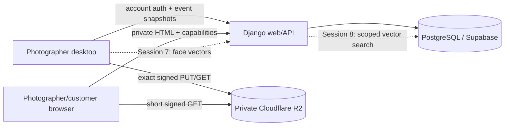

# OpenFotos product and technical plan

**Document status:** authoritative pilot plan, revised after Session 5

**Revision date:** 13 September 2026

**Implementation status:** Sessions 1–5 are implemented and retrofitted; Sessions 6–9 are planned

## 1. Purpose

OpenFotos is a private wedding-photo delivery system. A photographer organizes one wedding as a
main event, divides it into named sub-events such as Haldi, Reception, Marriage, or Pre-wedding,
uploads edited JPEGs through the desktop application, and publishes a private web gallery.

The finished product will let the photographer hand the main customer an owner link. That customer
can browse the full wedding or one sub-event and can create narrower guest links. A guest link can
allow either full browsing of its scope or only photos found by submitting an ephemeral selfie or
single-person reference photo.

The product does **not** build or expose precomputed people collections. Face embeddings are a
search index, not a customer-facing grouping system.

## 2. Product decisions fixed by this revision

1. `Event` is the main wedding and remains the tenant, lifecycle, quota, security, manifest,
   preview-policy, and retention boundary.
2. Every event contains one level of `SubEvent` records. Sub-events do not nest.
3. At least one active sub-event is required before upload. Every contribution batch belongs to
   exactly one active sub-event; photos cannot be uploaded directly to the main event.
4. The main gallery is an aggregate of all visible sub-events. A sub-event gallery is a strict
   filter of that same authorized set.
5. Sub-events are organized by the photographer during upload. They can be created, renamed,
   ordered, archived, and restored while the main event is unpublished.
6. A complete batch may be reassigned to another active sub-event before publication. Individual
   photos are not reassigned independently.
7. There are no uploader accounts, upload invitations, lead role, clusters, cluster review, or
   collections.
8. One photographer account may use at most ten active, tracked, revocable desktop installations
   per event.
9. Every access PIN is exactly four ASCII digits, securely generated by OpenFotos, displayed once,
   never user-chosen, and stored only as a peppered Argon2 hash.
10. Future owner and guest URLs are independent high-entropy capabilities. A PIN never provides
    security on its own.
11. Future face processing creates embeddings for detected faces in each photo and uploads them
    directly to the server. It does not cluster them.
12. Future selfie/reference search accepts exactly one usable face and reveals matched photos only
    within the link's event or sub-event scope.
13. Every authorized visitor may download original files within the set they can see. There is no
    separate download-policy setting.

These decisions supersede conflicting text in ADRs 0002, 0003, 0005, 0006, and 0007. ADR 0008
records the change.

## 3. Scope and release posture

### Pilot scope

- One initial photographer business, with tenant boundaries retained for safe expansion.
- Wedding-sized main events with up to 50 sub-events.
- Edited JPEG inputs, normally below 20–25 GB per main event.
- One photographer account and up to ten active desktop installations per event.
- Private originals, previews, thumbnails, manifests, and later face embeddings.
- Server-rendered photographer and visitor web experiences.
- Desktop-first ingestion and derivative processing.
- A supervised launch with synthetic or explicitly consented test media only.

### Non-goals

- Customer-visible people collections or automatic albums.
- Face clustering, naming people, identity enrollment, or demographic inference.
- Nested sub-events.
- Upload-only users or outside contributor invitations.
- Mobile applications, social features, public discovery, or public indexing.
- RAW/video ingestion, photo editing, duplicate-photo merging, or automatic curation.
- Per-photo sub-event reassignment.
- A claim that four-digit PINs alone resist guessing.

## 4. Vocabulary

| Term | Meaning |
|---|---|
| Photographer | Tenant that owns events and data. |
| Photographer account | Authenticated operator belonging to a photographer tenant. |
| Installation | One tracked desktop installation used by that account for an event. |
| Event | Main wedding and the root authorization/lifecycle/quota boundary. |
| Sub-event | One ordered, non-nested section inside an event. |
| Contribution batch | Immutable local/server batch assigned to one sub-event. |
| Asset | One uploaded photo record. |
| Original | Exact uploaded JPEG bytes. |
| Preview | Gallery-sized image, optionally watermarked. |
| Thumbnail | Clean small gallery-grid image. |
| Face index | Per-face embeddings attached to assets for scoped search. |
| Owner link | Future photographer-to-main-customer capability for the event. |
| Guest link | Future owner-created capability with explicit scope and view mode. |
| Full view | Browse every visible photo in the link scope and optionally search. |
| Selfie-only view | See only photos returned by an accepted face search. |

## 5. Roles and journeys

### Administrator

- Provisions photographer accounts and main events.
- Sets storage/retention limits and operational configuration.
- Can rotate event security material and revoke access during support incidents.
- Does not need access to customer media for ordinary operation.

### Photographer

1. Creates a main event such as `ABC Wedding`.
2. Creates active sub-events such as `Haldi`, `Reception`, and `Marriage`.
3. Signs into the desktop with the photographer account.
4. Chooses the main event and then exactly one sub-event.
5. Adds files/folders, validates them locally, approves an immutable batch, and uploads it.
6. Repeats for other installations and sub-events.
7. Renames/orders sections or moves a complete batch while the event is unpublished.
8. Reviews the aggregate gallery or a sub-event filter, closes intake, and publishes.
9. In Session 8, hands the owner link and four-digit PIN to the main customer.

### Main customer (future Session 8)

- Uses the owner capability plus its four-digit PIN.
- Browses All Photos or a chosen sub-event.
- Searches within the event or selected sub-event.
- Creates and revokes guest links with an event/sub-event scope, view mode, and expiry.
- Shares guest links rather than forwarding the owner capability.

### Guest (future Session 8)

- Opens a high-entropy guest URL and enters that link's four-digit PIN.
- With full view, browses and downloads all visible photos in scope and may run face search.
- With selfie-only view, submits an image containing exactly one usable face and sees/downloads
  only returned matches.

## 6. Product behavior

### 6.1 Main event and sub-events

- A sub-event belongs to one event and has `name`, `position`, and `is_archived`.
- Names are trimmed, contain 1–120 visible characters, and are unique case-insensitively within
  the event.
- Positions are positive display hints. Canonical ordering is position, name, then identifier.
- Only one nesting level exists.
- Archived sub-events remain recorded for audit and restoration but are absent from event snapshots,
  gallery queries, upload targets, and future share creation.
- Structure changes are blocked while Published, Archived, or Cancelled. The photographer must
  unpublish before changing structure.
- Archived sub-events and their assets do not participate in derivative readiness or future face
  search/publication readiness.

### 6.2 Contribution batches

- The desktop must possess a fresh server snapshot containing the selected active sub-event.
- A local batch stores `event_id`, `sub_event_id`, and `installation_id` before any source selection.
- A reservation contains the same sub-event identifier in its signed/versioned request contract.
- The server verifies that the sub-event exists, belongs to the event, and is active.
- The complete reservation is all-or-nothing and idempotent.
- Object keys are always server-generated; the client never chooses a bucket key.
- An archived sub-event immediately blocks new reservation, lease, original-readback, and derivative
  work for its batches.
- Reassignment moves the complete batch and therefore all of its assets atomically. The audit log
  records both sub-event identifiers.

### 6.3 Main and filtered galleries

- `All Photos` is the default event gallery and aggregates all non-archived sub-events.
- Each sub-event has a stable filtered route beneath the event route.
- Filtered list, photo, previous, and next operations all carry the sub-event boundary.
- Supplying a photo from another sub-event to a filtered route returns not found.
- Pagination is 48 thumbnails per page.
- Browser HTML is private, `no-store`, and `noindex`; media URLs are short-lived signed URLs.
- Original filenames are not exposed in visitor HTML.

### 6.4 Current interim visitor access

Sessions 2 and 5 contain one high-entropy event token plus a four-digit event PIN so the implemented
gallery remains testable. Session 8 will replace or migrate that handoff into explicit owner and
guest capability records. Until Session 8, the current event link must not be described as a guest
link and cannot express sub-event/full/selfie-only sharing policy independently.

## 7. Lifecycle

The main event keeps the existing state machine:

```text
Draft -> Uploading -> Processing -> Review -> Published
  |          |            |           |          |
  +----------+------------+-----------+--------> Archived
  +----------+------------+--------------------> Cancelled
                         failures -------------> Failed
```

Important rules:

- Intake is separately `open` or `closed` and uses monotonically increasing generations.
- Reopening intake creates a new generation and invalidates the previous current manifest.
- Publication requires a current committed ingestion manifest, confirmed preview policy, complete
  derivatives for every visible asset, at least one active sub-event, a configured PIN, and a
  future expiry.
- After Session 7, publication also requires terminal face analysis for every visible asset:
  `indexed` or `no_usable_face`.
- Publishing/unpublishing is controlled only at main-event level.
- Sub-events do not have independent lifecycle, quota, preview policy, or retention settings.

## 8. Authorization model

| Operation | Required boundary |
|---|---|
| Browser dashboard | Active account membership and matching photographer host |
| Desktop login/resume | Active membership and matching photographer host |
| Event snapshot | Session tenant equals event tenant |
| Register installation | Same photographer/account/event; maximum ten active |
| Reserve batch | Same tenant, active installation, open intake, active selected sub-event |
| Upload/derivative lease | Same tenant, authorized installation, batch and active sub-event |
| Manage sub-events/batches | Active photographer membership; main event unpublished |
| Main gallery | Photographer membership or valid event/owner/full guest capability |
| Filtered gallery | Main authorization plus exact sub-event scope |
| Selfie result | Valid search-capable link plus returned match membership |
| Original download | Valid authorization plus photo visibility in current scope/result set |

All denials should be indistinguishable where revealing existence would widen access. Event,
sub-event, batch, asset, face, and share queries must apply their tenant/scope filters in the
database query, not after returning an object.

## 9. System architecture



### Desktop owns

- Local source discovery, JPEG validation, checksums, and durable SQLite checkpoints.
- Explicit main-event and sub-event selection.
- Original transfer and derivative generation/upload.
- In Session 7, face detection and embedding generation using the event's pinned model contract.
- No tenant authorization decision and no final object-key construction.

### Django owns

- Tenant/account authorization, event lifecycle, sub-events, installation registry, quotas, and
  audit records.
- Batch reservation, immutable manifests, object-key construction, upload leases, and verification.
- Gallery access and signed object reads.
- In Session 8, owner/guest link policy, PIN verification, search scope, and result authorization.

### PostgreSQL owns

- Relational state and transactional counters.
- Immutable manifest metadata and idempotency records.
- In Session 7, model-versioned per-face vectors (pgvector) scoped by event and asset.

### R2 owns

- Private originals, previews, thumbnails, optional watermark marks, and immutable manifests.
- No public bucket listing and no permanent public object URL.
- Selfies/reference search inputs are never written to R2.

## 10. Data model

### Implemented through revised Session 5

```text
Photographer 1---* PhotographerMembership *---1 User
Photographer 1---* Event
Event 1---* SubEvent
Event 1---* EventInstallation *---1 User
EventInstallation 1---* ContributionBatch *---1 SubEvent
ContributionBatch 1---* Asset 1---* AssetObject
Event 1---* IngestionManifest
Event 1---1 PreviewPolicy
Event/other subjects 1---* AuditEvent
DesktopSession *---1 Photographer/User
```

Key invariants:

- `ContributionBatch.sub_event` is non-null.
- A batch's installation and sub-event must resolve to the same event; services enforce this under
  an event row lock.
- Active installations have an account owner.
- Asset objects are unique by asset and variant.
- Event quota counters are changed only in transactional ingestion services.

### Planned Session 7

```text
Asset 1---1 FaceAnalysis
Asset 1---* FaceEmbedding
```

`FaceAnalysis` records the pinned model identifier/hash, attempt state, terminal status, detected
face count, usable-face count, and timestamps. `FaceEmbedding` records an event, asset, face ordinal,
normalized vector, detector confidence/quality metadata, and model contract. There is no Cluster or
Collection table.

### Planned Session 8

```text
Event 1---1 OwnerCapability
OwnerCapability 1---* GuestCapability
GuestCapability *---0..1 SubEvent
Capability/SearchSession 1---* AuthorizedSearchResult *---1 Asset
```

Capability secrets are stored as digests, PINs as peppered Argon2 hashes, and returned search sets
as short-lived authorization records or equivalent signed server state. Raw selfies are not stored.

## 11. Object layout

Object keys remain event- and asset-scoped:

```text
events/{event_id}/originals/{asset_id}.jpg
events/{event_id}/previews/{asset_id}.jpg
events/{event_id}/thumbnails/{asset_id}.jpg
events/{event_id}/manifests/generation-{number}.json
events/{event_id}/preview-policy/{policy_id}.png
```

Sub-event identity belongs in transactional metadata and manifests, not in the object key. Moving a
batch must not copy immutable media. A manifest asset entry includes its batch, installation, and
sub-event identifiers.

## 12. Ingestion and gallery processing

```mermaid
sequenceDiagram
    participant P as Photographer
    participant D as Desktop
    participant S as Django
    participant R as Private R2

    P->>D: Sign in; select Event then SubEvent
    D->>D: Discover, validate, checksum, approve batch
    D->>S: Reserve immutable batch with sub_event_id
    S->>S: Validate tenant, installation, child, quota, idempotency
    S-->>D: Exact upload leases
    D->>R: PUT originals
    D->>S: Verify each object
    S->>R: HEAD checksum/length metadata
    D->>D: Render preview and thumbnail
    D->>R: PUT derivatives through exact leases
    S->>R: HEAD and verify derivatives
    P->>S: Close intake and finalize generation
    S->>R: Write immutable aggregate manifest
```

Reliability rules:

- One to four concurrent transfers per desktop.
- Create-only object writes, exact content length/MD5/type/SHA-256 headers, and five-minute leases.
- Lost responses are recovered by querying server state and verifying object metadata.
- Local source bytes are checked again during transfer.
- Five derivative failures require explicit photographer exclusion or retry.
- Preview policy is event-scoped and immutable once processing begins; thumbnails stay clean and
  originals remain byte-identical.

## 13. Face indexing plan (Sessions 6–7, not implemented)

### Benchmark before dependency

Session 6 must test the selected detector/recognizer on 500–1,000 consented representative photos.
Record CPU, memory, face yield, false matches/misses, group-photo behavior, model files/hashes,
embedding dimension/normalization, thresholds, and projected full-event time. The decision is a
go/no-go gate, not an assumed library choice.

### Per-photo processing

1. Desktop reads the already approved local original.
2. It applies the pinned orientation/color preprocessing contract.
3. It detects zero or more faces and evaluates quality.
4. It produces one normalized embedding per usable face.
5. It uploads a strict idempotent face-analysis document directly to Django.
6. Django validates tenant, event, asset ownership, model ID/hash, vector dimension, finite values,
   normalization tolerance, ordinals, counts, and terminal status before persistence.

Zero detected/usable faces is a valid terminal result. A retry with the same model and content is
idempotent; a different model contract or payload conflicts and requires an explicit rebuild path.

### Search

- Input may be a selfie or a photo selected from the guest's device.
- Decode, orientation, size, and face-count validation happen before recognition.
- Zero usable faces returns a clear rejection. More than one usable face also returns a rejection;
  the user must choose an image with exactly one person suitable for matching.
- The raw image and temporary crop live only in request memory/private temporary storage and are
  removed before the response completes.
- Vector queries always filter event first and optional sub-event second, then apply the calibrated
  similarity threshold.
- Multiple matched faces on one asset collapse to one photo result.
- No name, persistent identity, cluster, or collection is produced.

## 14. Sharing plan (Session 8, not implemented)

### Owner capability

- Created by the photographer for the complete main event.
- High-entropy URL secret, independently revocable and expiring.
- Separate auto-generated four-digit PIN, displayed once.
- Allows All Photos, all active sub-events, scoped face search, original downloads, and guest-link
  management.

### Guest capability

Each guest capability has:

- an independent high-entropy URL secret;
- an independent auto-generated four-digit PIN displayed once;
- required expiry, capped by the event/owner expiry;
- revocation/version state;
- scope: whole event or exactly one active sub-event;
- mode: `full` or `selfie_only`.

Full mode can browse, search, and download all visible photos in scope. Selfie-only mode initially
reveals no photos, accepts exactly-one-face searches, and can view/download only returned matches.
A guest link cannot create another link or widen itself.

### PIN security

Four digits provide only 10,000 combinations. Security therefore requires all of the following:

- at least 256 bits of unguessable URL entropy;
- Argon2 PIN hashing with a dedicated server-side `EVENT_PIN_PEPPER` (and later share-pin pepper if
  separated);
- database-backed throttling by capability and abuse signals;
- generic failure responses and security audit events;
- short sessions, expiry, revocation, and URL-secret rotation;
- no PIN, URL secret, selfie, face crop, or vector in logs/errors/analytics.

Pepper rotation needs an explicit rollout that invalidates or rehashes access; it must never silently
make every link unverifiable.

## 15. Original downloads

There is no download policy selector. Authorization is derived from visibility:

- photographer and owner: every visible original in the event;
- full event guest: every visible original in the event;
- full sub-event guest: every visible original in that sub-event;
- selfie-only guest: only originals corresponding to that search's authorized results.

Django issues short-lived signed GET URLs with attachment disposition after re-evaluating link,
scope, expiry, revocation, sub-event status, asset visibility, and (for selfie-only) result
membership. Downloaded bytes must match the original upload checksum.

## 16. Privacy, consent, and retention

- Customer photographs and face embeddings are personal data and must be treated as highly
  sensitive even where a jurisdiction does not use the same biometric-data terminology.
- Obtain a documented lawful basis/consent and give a clear notice describing face matching,
  purpose, retention, sharing, withdrawal, and contact paths.
- Do not infer identity or sensitive traits.
- Minimize data: retain one search index only as long as the event needs search; never retain search
  selfies or crops; avoid filenames and media URLs in logs.
- Expiry must disable web access immediately. A later retention job deletes database face rows,
  media objects, manifests, and capabilities according to the agreed policy, with audit evidence.
- Backups, support access, breach response, processor agreements, data-location choices, and deletion
  verification are launch requirements.
- The notified Indian Digital Personal Data Protection Rules 2025 and the Act require a launch-time
  legal review; this document is an engineering plan, not legal advice.

## 17. Security and threat model

| Threat | Required control |
|---|---|
| Cross-tenant identifier substitution | Tenant predicate in every database query and denial tests |
| Cross-sub-event widening | Exact child predicate in list/photo/search/download routes |
| Four-digit guessing | High-entropy URL, Argon2+pepper, throttling, expiry, audit |
| Leaked link | Independent capabilities, narrow scopes, revoke/rotate, short sessions |
| Malicious upload manifest | Strict fields/types, limits, server object keys, checksums |
| Over-quota races | Event row lock and transactional byte reservation |
| Stale/revoked installation | Active installation checks on new transfer work |
| Model mismatch | Pinned ID/hash/dimension/normalization and fail-closed validation |
| Face-search overreach | Event/sub-event SQL filters before distance query |
| Selfie retention | In-memory/private temp processing, guaranteed cleanup, log redaction |
| Signed URL residual access | Five-minute TTL and explicit documented residual-risk acceptance |

Secrets, model weights, customer media, selfies, crops, and embeddings must never enter git.

## 18. API and contract rules

- JSON contracts reject missing and extra fields.
- Event snapshots include only active sub-events in canonical order.
- Contribution input requires `sub_event_id`.
- UUIDs identify records; public capability secrets are separate random values.
- Mutation retries use actor-scoped idempotency keys with request hashes.
- Stable error codes distinguish correctable state without disclosing foreign objects.
- Database enum values and shared Python contracts change together through forward migrations.
- Future face/share endpoints must be versioned only after the Session 6 model contract and Session
  8 capability schema are accepted.

## 19. Operations and hosting

The planned stack remains Django on Railway, PostgreSQL/Supabase, and private Cloudflare R2. Exact
vendors remain replaceable at the boundaries above.

- Railway supports custom and wildcard domains; both ownership verification and TLS/DNS behavior
  must be rehearsed before launch.
- Supabase supplies PostgreSQL and pgvector; choose a specific region as a data-location control and
  confirm backup/PITR behavior for the purchased plan.
- R2 supplies S3-compatible private object storage. Location hints are best-effort and not a data
  residency guarantee; use a jurisdiction feature only if it satisfies the legal requirement.
- Track storage, Class A writes, Class B reads, Railway compute/memory/egress, database size/vector
  index size, and signed-read volume. Treat provider prices as time-sensitive and verify the linked
  pricing pages during launch budgeting.
- Use Standard R2 storage for the short pilot unless a measured lifecycle/retention pattern justifies
  another class.

Official references checked for this revision:

- [Cloudflare R2 pricing](https://developers.cloudflare.com/r2/pricing/)
- [Cloudflare R2 data location](https://developers.cloudflare.com/r2/reference/data-location/)
- [Railway pricing](https://docs.railway.com/pricing)
- [Railway custom and wildcard domains](https://docs.railway.com/networking/domains/working-with-domains)
- [Supabase PostgreSQL overview](https://supabase.com/docs/guides/database/overview)
- [Supabase regions](https://supabase.com/docs/guides/platform/regions)
- [Supabase vector indexes](https://supabase.com/docs/guides/ai/vector-indexes)
- [Digital Personal Data Protection Rules, 2025 notification](https://www.meity.gov.in/static/uploads/2025/11/53450e6e5dc0bfa85ebd78686cadad39.pdf)

## 20. Observability and support

- Structured logs contain request/correlation IDs and stable error codes, never PINs, URL secrets,
  filenames, media URLs, selfie data, vectors, or raw client IPs.
- Audit events cover authentication, PIN outcomes, event transitions, installation registration and
  revocation, sub-event changes, batch reassignment, exclusions, publication, and future capability
  changes.
- Metrics include upload/derivative/face-analysis latency and failure counts, quota reservations,
  readiness lag, search rejection/match rates without images or vectors, and throttling.
- Runbooks cover object-store outage, lost refresh response, stuck lease, failed derivative,
  incompatible model, leaked link, pepper rotation, expiry/deletion, and database restore.

## 21. Testing strategy

### Fast deterministic suite

- Contract strictness and canonical ordering.
- Event lifecycle and publication gates.
- Four-digit ASCII PIN, Argon2/pepper, throttling, and audit redaction.
- Tenant, event, sub-event, installation, batch, and asset isolation.
- Quota/idempotency/retry/checksum/lifecycle failure modes.
- Local checkpoint migration, forced restart, changed sources, and sub-event persistence.
- Gallery aggregation, filtering, pagination, archive visibility, and no scope widening.
- Derivative metadata stripping and unchanged original hashes.

### Provider and release checks

- Opt-in synthetic R2/MinIO contract test.
- PostgreSQL migration and concurrent reservation test.
- Windows/macOS desktop packaging and 10,000-photo rehearsal.
- Session 6 consented face benchmark before face schema/API implementation.
- Session 8 end-to-end tests proving selfie cleanup and capability-scope enforcement.
- Restore a production-shaped database backup into an isolated environment.

## 22. Delivery plan

### Sessions 1–5: implemented and retrofitted

Repository/tooling, accounts/tenancy/lifecycle, local inventory, direct upload/manifests,
derivatives, and private galleries are complete. The post-Session-5 retrofit removes uploader
invitations/roles/download policies, introduces mandatory sub-events, binds batches to one child,
adds main/filtered galleries and management, changes the PIN to four generated digits with a
dedicated pepper, and updates migrations/contracts/tests.

### Session 6: face benchmark and contract

No production embedding persistence. Benchmark the replaceable engine and freeze model ID/hash,
preprocessing, vector dimension/normalization, quality rules, similarity metric, and thresholds.

### Session 7: direct face indexing and readiness

Implement per-asset face-analysis state and per-face vector upload/validation. Add event/sub-event
search indexes and the analysis publication gate. Do not add collections or clustering.

### Session 8: owner/guest sharing, selfie search, and downloads

Implement owner and independently revocable guest capabilities, four-digit generated PINs,
event/sub-event and full/selfie-only scope, exactly-one-face ephemeral search, authorized result
sets, and original downloads derived from visibility.

### Session 9: hardening and launch rehearsal

Complete deployment, wildcard domains, proxies/security headers, monitoring, backups/restores,
retention deletion, packaging, incident runbooks, cost limits, performance, legal/licence review,
and a clean end-to-end rehearsal.

## 23. Acceptance criteria for this revision

The Sessions 1–5 retrofit is complete only when:

- a batch cannot exist or reserve without an active child belonging to its event;
- event/sub-event snapshots and local checkpoints round-trip the child assignment;
- one photographer account can use no more than ten active installations;
- the removed invitation/uploader/download-policy endpoints and UI are absent;
- a photographer can create, rename, order, archive/restore sub-events and reassign complete batches
  only while the event is unpublished;
- main gallery queries aggregate active children, filtered queries cannot widen, and archived child
  assets are hidden;
- four-digit ASCII PINs are generated, peppered, Argon2-hashed, rate-limited, and absent from logs;
- fresh forward migrations, tests, static checks, and Django checks pass;
- current and future documentation contains no active collection/clustering design.

## 24. Explicitly deferred decisions

These require evidence or Session 8 design and must not be guessed in Sessions 1–5:

- final face model, redistributable weight licence, dimension, and thresholds;
- exact face-analysis retry/rebuild UX;
- owner/guest capability schema and default/max expiry durations;
- whether the interim event token is migrated or replaced;
- share-PIN pepper separation/rotation rollout;
- face-index and media retention duration agreed with the client;
- launch jurisdiction/data-region/legal basis and customer notice text;
- production scale/cost limits after representative measurements;
- application source licence before any public repository release.

No later session may reintroduce upload-only identities, customer collections, or pre-clustering
without a new product decision and ADR.
